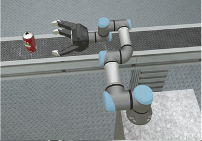

# UR3e_simulation
The project consists of simulation of [UR3e Robot](https://www.universal-robots.com/products/ur3-robot/) in [Webots: (Robot Simulator)](https://cyberbotics.com/). The main purpose of project is to demostrate forward and invrse kinematcs of a 6-DOF manipulator. 

The Forward and inverse kinematics for the robot is applied through the task of Picking cans from conveyor belt and dropping them into specific cartons. 

## Codes
* MATLAB: The folder *MATLAB* contains the MATLAB codes of forward and inverse kinematics
* WEBOT_Simulation: The folder contains the final simulation files of UR3e model in Webots

## Reports and Simulation
* [Report](https://github.com/rahul0805/UR3e_simulation/blob/main/report/final_report.pdf)
* [Videos](https://youtube.com/playlist?list=PLahYkbmWckzO9zV2hK6wFvUlVQJJ0zTHX) 

